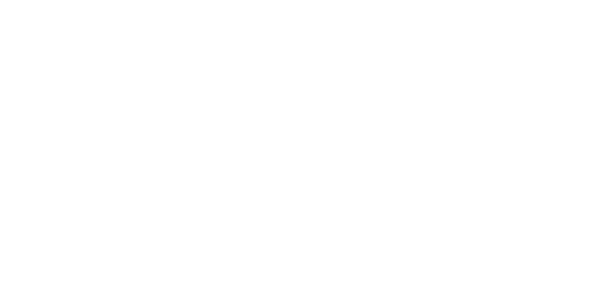

# Lab Week 03 Mon-Tue

This lab, we're dropping the hammer on you guys.

You'll be exploring:
- State Machines in Verilog
- Button Debouncing
- Clock Dividers
- Generating PWM Waveforms in Verilog
- Time Management

### Required components
1. FPGA (either ICESuger or ICESuger-pro)
2. 7 segment display (with a 220 Ohm resistor for the common pin)
3. 1x DIP switch (in total 1 switch will be used)
4. 2x Push Buttons
5. Breadboard + enough wires to connect everything

### Wiring

#### On-board RGB LED
Both the ICESugar-Pro and ICESugar come with on-board RGB LEDs. On the ICESugar-Pro, the RGB pins are assigned to the following pins:
```
A12 -> blue
A11 -> green
B11 -> red
```
The ICESugar uses the following pins:
```
39 -> blue
41 -> green
40 -> red
```
The **ICESugar-pro** defaults to pulldown inputs so the other side of the switches should connect to 3V. The regular **ICESugar** defaults to pullup inputs so the other side of the switches should connect to ground.

## Introduction
The objective of this Lab is to build up to the final exercise. Each exercise adds another layer of complexity. We recommend introducing each exercise as its own Verilog module.

You should be testing your solution either through simulation or synthesis after each exercise.

> Note: As a reminder. We will ***NOT*** be looking through your code to help you debug your logic. Be sure to design your solutions thoughtfully and incrementally.

## Exercise 1: Toggle an LED using a Push Button
Create a simple SM that toggles one of the on-board LEDs. The LED should start off. Pressing the button once should toggle it ON. Pressing it again should toggle it OFF. Use the BACKGROUND.md for an explanation on modeling SMs in Verilog.

At this point we don't reccomend synthesizing anything. Focus on verifying the functionality of your SM in simulation. Synthesis at this point may exhibit glitchy behavior.

## Exercise 2: Debouncing Push Buttons
We asked you to avoid synthesizing your previous solution because you'd be ticking your SM at your board's native clock speed. For the ICESugar-Pro, that's 25MHz. Ticking your SM at this speed means your buttons will also be sampled 25 million times per second, which leaves your SM susceptible to glitching as a result of button bouncing.

Push buttons are effectively metal plates seperated by a spring. When you press the button, that causes the plates to slam into each other, and causes viberations which result in digital noise. This can be picked up by your FPGA's logic.

So now we introduce 2 techniques to _debounce_ your buttons.
1. Since this glitch is caused by ticking your SM too fast, one obvious solution is to slow the SM down. To do this, you create a _clock divider_, that slows your SM down to something like 250ms. This leaves plenty of time for the push button to stablize, leaving a higher chance for your SM to sample a true press rather than a glitch.
2. Another alternative is to create a debouncing module based on a counter. This counter increments only when the button is pressed. Once released, it resets to 0. Assuming the button is truly pressed (not glitching/bouncing), the counter will eventually reach some threshold value after which you can consider the button pressed.

Please see BACKGROUND.md for more information.

At this point you should be able to test your solution on the FPGA.

## Exercise 3: 
Modify the code so that instead of toggling an LED, when the push button is pressed, a 4-bit counter `duty_cycle` is incremented. If `duty_cycle` reaches a value of 10, it should reset to 0.

For this exercise you verify only in simulation.

## Exercise 4:
Using the decoder solution from Lab 2, display the result of `duty_cycle` as a hexadecimal value on the 7-segment display.

You should verify this works in synthesis.

## Exercise 5:
In addition to driving the 7-segment display, we'll use `duty_cycle` to control the brightness of an on-board LED using PWM.
You can make your PWM Period to just be 10 clock cycles of your FPGA's clock.

Please observe the hint provided in BACKGROUND.md for a suggestion on generating a PWM waveform more easily.

By completing this exercise, the button should control the LED in such a way that each press of the button increases the brightness of the LED by 10%. Pressing the button ten times should leave the LED at 100% brightness. Pressing it an eleventh time should reset it back to 0% brightness (turning it OFF).

> Note: The PWM waveform should have a small enough period so as to ***NOT*** show _any_ visible flicker of the LED.

## Exercise 6:
Add another push button, so that you can control the brightness of 2 LEDs simultaneously.

## Exercise 7:
Add the DIP Switch so that we can choose which `duty_cycle` counter is displayed on the 7 Segment. Use the Decimal Point to indicate which counter is being displayed.

So, for example, if the switch is in the OFF position, the RED LED's `duty_cycle` value is displayed, and the decimal point is turned OFF. If the switch is moved to the ON position, the BLUE LED's `duty_cycle` value is displayed, and the decimal point is turned ON.

## Diagram


## Deadline
This assignment is due next Monday before the start of Lab. Make sure to demo by the last OH on Monday.
